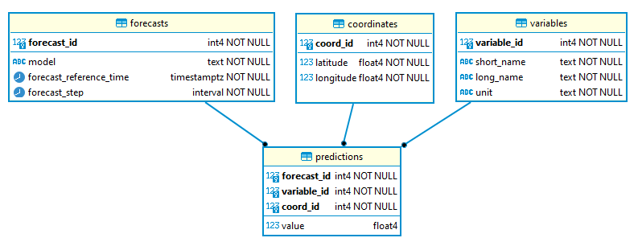

# Should I Shovel?

## Product requirements
A web app which answers the question of whether I should shovel snow.

## Learning goals
I want to explore some data ops and web technologies. My current experience is python, sql and datascience libraries.
For this project I will stay within the python ecosystem.

## Code conventions
* mypy static type checking
* black code formatting

## Tech stack
### Frontend

### Data model
RDMS: Postgres
Extensions: Cube

#### Entity Relationship Diagram:

#### Disk usage estimates
During each HRDPS model run it calculates 49 prediction sets: 000 being the current values and 048 future values at 1 hour increments making up 48 hours worth of future predictions. A single prediction set is a 2576x1456 coordinate raster each with each point being prediction value. 49 sets * 2576x1456 raster = 183 782 144 rows for each model run for a single variable.

forecast table:
Immaterial. 1 row expected.

variables table:
Immaterial. <10 rows expected.

coordinates table:
2576*1456 = 3 750 656 rows
coord_id (int4), latitude (int4) and longitude (int4) each = 3 750 656 rows * 4 bytes = 14 651 KB each
14 651 KB data * 3 columns + 24 bytes * 3 750 656 rows of overhead per row =

### APIs
* Generic weatherAPI
* Maybe weather news headlines

### Infrastructure
* Terraform
* AWS
* Airflow for scheduled jobs
* DBT for postgres work

## Feature timeline
- [ ] Static page MVP
- [ ] Static served using django
- [ ] Containerize
- [ ] Detect location using geoip
- [ ] Incorporate current weather conditions
- [ ] Show historical statistics
- [ ] Record user feedback
- [ ] Incorporate weather forecast
- [ ] $$$Ads for snow shovels$$$
